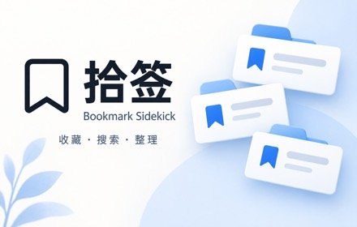
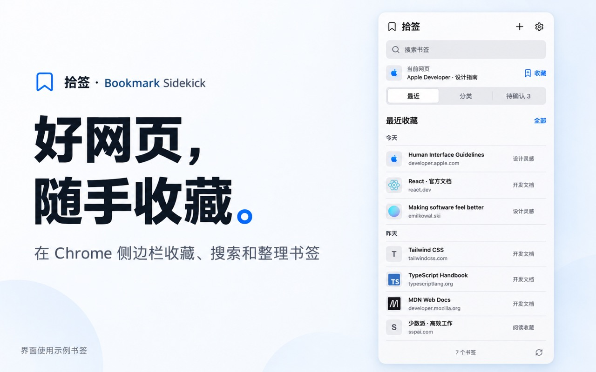

<p align="center">
  
</p>

<h1 align="center">拾签 · Bookmark Sidekick</h1>

<p align="center">好网页，随手收藏。<br>在 Chrome 侧边栏里，找回值得再看的内容。</p>

<p align="center">
  <a href="#安装">安装</a> ·
  <a href="#开始使用">开始使用</a> ·
  <a href="PRIVACY.md">隐私政策</a> ·
  <a href="https://github.com/dnslin/bookmark-sidekick/issues">反馈问题</a>
</p>



<p align="center"><sub>界面使用示例书签。实际内容来自你的 Chrome 书签。</sub></p>

## 收藏之后，也能轻松找到

拾签是一个放在 Chrome 侧边栏里的个人书签助手。打开侧边栏，就能浏览已有书签、收藏当前网页，再按分类和标签找到需要的内容。

| 想做什么 | 拾签可以帮你 |
| --- | --- |
| 随手保存好网页 | 一键收藏当前页，显示网站图标，按最近收藏浏览 |
| 找回以前的收藏 | 搜索书签，按分类和标签筛选 |
| 整理积累的书签 | 可选接入自己的 AI 接口，生成分类、标签和摘要 |
| 留下值得再读的正文 | 授予站点权限后保存网页正文，支持本地阅读 |
| 检查旧链接 | 检查网页是否仍可访问 |
| 备份整理成果 | 导出和恢复模型配置、分类、书签信息与网页快照 |

**AI 是可选项。** 不配置模型，也能使用书签浏览、搜索和收藏功能。拾签的分类只用于扩展内的整理视图，不会移动 Chrome 原有的书签文件夹。

## 安装

### 使用发布包

1. 在 [Releases](https://github.com/dnslin/bookmark-sidekick/releases) 下载 Chrome 扩展压缩包并解压。
2. 在 Chrome 打开 `chrome://extensions`。
3. 开启右上角的「开发者模式」。
4. 点击「加载已解压的扩展程序」，选择解压后的扩展目录。

### 从源码构建

需要 Node.js 22.16 或更高版本。

```bash
npm install
npm run build
```

在 Chrome 扩展管理页加载 `.output/chrome-mv3` 目录。

## 开始使用

1. **打开侧边栏**：点击扩展图标，拾签会读取已有的 Chrome 书签。
2. **收藏当前网页**：打开喜欢的网页，点击「收藏」。允许站点访问权限后，还可保存正文快照。
3. **查找和整理**：使用搜索框，或切换到「分类」按分类和标签筛选。
4. **按需启用 AI**：在设置中填写兼容 OpenAI 的接口地址、API Key 和模型名称，确认数据发送授权后保存并分析。

批量整理生成的建议会进入「待确认」，由你决定是否应用。新收藏书签的高置信度分类可自动应用，其余建议需要确认。模型服务可能由对应服务商单独收费。

## 备份与恢复

在设置中导出完整备份，可以保存：

- 模型配置与自定义分类
- 书签的分类、标签和摘要
- 已保存的网页正文

导入备份时会先显示内容概览，确认后再写入。

**备份文件包含明文 API Key，请保存在可信的位置，不要公开分享。**

## 数据由你掌握

- 数据主要保存在当前浏览器中。
- 没有配置并授权 AI 时，不会向模型发送书签内容。
- 使用 AI 时，待处理书签的标题、网址、原文件夹和已保存正文会发送到你填写的模型接口。
- 在拾签中删除书签，会同时删除对应的 Chrome 原生书签。
- 卸载扩展会清除拾签保存的本地数据，但不会删除 Chrome 原有书签。

完整说明见[隐私政策](PRIVACY.md)。

## 开发

```bash
npm run dev       # 开发模式
npm run check     # 类型检查、测试和构建
npm run zip       # 生成 Chrome 安装包
```
